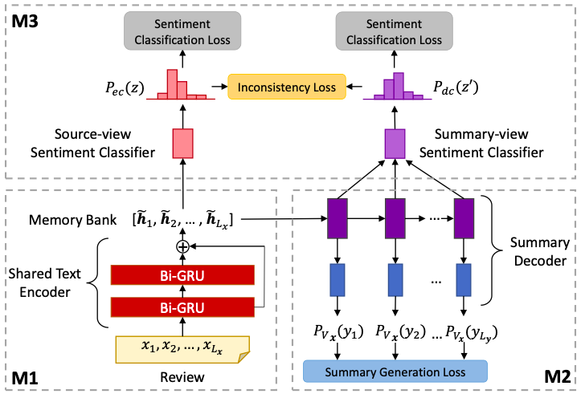

# A Unified Dual-view Model for Review Summarization and Sentiment Classification with Inconsistency Loss

This repository contains the source code for our SIGIR 2020 paper "[A Unified Dual-view Model for Review Summarization and Sentiment Classification with Inconsistency Loss](https://arxiv.org/abs/2006.01592)". 

**Important Notice: We found a bug in our evaluation function for the balanced accuracy score. We have updated the [code](https://github.com/kenchan0226/dual_view_review_sum/commit/3d22a75765fa97c5df2d55b6b03cd3fa3d49a57a) and the results in our paper (Table 3) on [arXiv](https://arxiv.org/abs/2006.01592). Please make sure that you are using the most updated version of our code. Nevertheless, our model still achieves higher balanced accuracy scores than the baselines after we fixed this bug. Our apologies for the inconvenience caused.**

Some of our source code are adapted from https://github.com/ChenRocks/fast_abs_rl. 

If you use this code, please cite our paper:
```
@inproceedings{DBLP:conf/sigir/ChanCK20,
  author    = {Hou Pong Chan and
               Wang Chen and
               Irwin King},
  title     = {A Unified Dual-view Model for Review Summarization and Sentiment Classification
               with Inconsistency Loss},
  booktitle = {Proceedings of {SIGIR} 2020, Virtual
               Event, China, July 25-30, 2020},
  pages     = {1191--1200},
  year      = {2020},
  url       = {https://arxiv.org/abs/2006.01592},
  doi       = {10.1145/3397271.3401039},
  biburl    = {https://dblp.org/rec/conf/sigir/ChanCK20.bib},
  bibsource = {dblp computer science bibliography, https://dblp.org}
}
```

## Model Architecture


## Dependencies
- Python 3.6+
- Pytorch 1.1
- NLTK
- pyrouge

Please refer to the requirements.txt for the full dependencies. 


## Datasets
We use the **Sports and Outdoors**, **Toys and Games**, **Home and Kitchen**, **Movies and TV** datasets from from 5-core subsets of the [Amazon review corpus](http://jmcauley.ucsd.edu/data/amazon/) by Prof. Julian McAuley.

The followings are the URLs of our preprocessed versions of these datasets. 
https://www.dropbox.com/s/2b5ueuj6bqpfyvh/min_4_reviews_Sports_and_Outdoors_5.tar.gz?dl=0
https://www.dropbox.com/s/bf1im78iz0cvpta/min_4_Toys_and_Games_5.tar.gz?dl=0
https://www.dropbox.com/s/52wyjfz1xz4oeb4/min_4_Home_and_Kitchen_5.tar.gz?dl=0
https://www.dropbox.com/s/a17hub5m1osdukw/min_4_Movies_and_TV_5.tar.gz?dl=0

If you use these datasets, **Please cite one or both of the following papers**:

```
Ups and downs: Modeling the visual evolution of fashion trends with one-class collaborative filtering
R. He, J. McAuley
WWW, 2016

Image-based recommendations on styles and substitutes
J. McAuley, C. Targett, J. Shi, A. van den Hengel
SIGIR, 2015
```


<!--
Data Preprocessing
Download Stanford CoreNLP English version from https://stanfordnlp.github.io/CoreNLP/history.html
First, you need to run a corenlp server on the same server. cd to the directory of the standford corenlp. Then execute `java -mx4g -cp "*" edu.stanford.nlp.pipeline.StanfordCoreNLPServer -preload tokenize,ssplit -status_port 9000 -port 9000 -timeout 60000`.
Open another terminal and execute the following command. It will create a file called `reviews_Sports_and_Outdoors_5_tokenized.json`. 
`python3 tokenize_raw_review.py -raw_data_file reviews_Sports_and_Outdoors_5.json`
Split the data into train, valid, test. Remove too long and too short review and summary
`python3 preprocess_raw_review.py -raw_data_file reviews_Sports_and_Outdoors_5_tokenized.json -out_dir datasets/processed_reviews_Sports_and_Outdoors_5 -num_valid 9000 -num_test 9000 -is_shuffle -min_review_len 16 -min_summary_len 4`
`python3 preprocess_raw_review.py -raw_data_file reviews_Toys_and_Games_5_tokenized.json -out_dir datasets/processed_reviews_Toys_and_Games_5 -num_valid 8000 -num_test 8000 -is_shuffle -min_review_len 16 -min_summary_len 4`
`python3 preprocess_raw_review.py -raw_data_file reviews_Home_and_Kitchen_5_tokenized.json -out_dir datasets/processed_reviews_ome_and_Kitchen_5 -num_valid 10000 -num_test 10000 -is_shuffle -min_review_len 16 -min_summary_len 4`
`python3 preprocess_raw_review.py -raw_data_file reviews_Movies_and_TV_5_tokenized.json -out_dir datasets/processed_reviews_Movies_and_TV_5 -num_valid 20000 -num_test 20000 -is_shuffle -min_review_len 16 -min_summary_len 4`
Compute and export the class distribution on the training set
`python3 compute_rating_stat.py -data_dir datasets/processed_reviews_Sports_and_Outdoors_5 -split train`
-->

## Training

- Compute and export the class distribution on the training set, which will be used by the training script. 
`python3 compute_rating_stat.py -data_dir datasets/processed_reviews_Sports_and_Outdoors_5 -split train`

- Script for training a word2vec embedding on the training set: 
`python3 train_word2vec.py -data datasets/processed_reviews_Sports_and_Outdoors_5 -path word_embeddings/sport_and_outdoors -dim 128`

- Scripts for training our dual-view model with inconsistency loss
```
python3 train_ml.py \
-data=datasets/processed_reviews_Sports_and_Outdoors_5 \
-exp_path=exp/%s.%s \
-exp=train_movie_dual_view_inc_seed_250 \
-epochs=50 \
-checkpoint_interval=1000 \
-copy_attention \
-batch_size=32 \
-seed=250 \
-w2v=word_embeddings/sport_and_outdoors \
-v_size=50000 \
-word_vec_size=128 \
-encoder_size=256 \
-decoder_size=512 \
-enc_layers=2 \
-residual \
-model_type=multi_view_multi_task_basic \
-dropout=0.0 \
-dec_classify_input_type=dec_state \
-classifier_type=word_multi_hop_attn \
-dec_classifier_type=word_multi_hop_attn \
-gen_loss_weight=0.8 \
-class_loss_weight=0.1 \
-inconsistency_loss_type=KL_div \
-inconsistency_loss_weight=0.1 \
-early_stop_loss=joint \
-batch_workers 0
```

## Predict

- Download pyrouge, and save it to `path/to/pyrouge`. 
`git clone https://github.com/andersjo/pyrouge.git`

- Export ROUGE score enviornment variable
`export ROUGE=[path/to/pyrouge/tools/ROUGE-1.5.5]`

- Make evaluation reference for a dataset (Only need to do it for once for each dataset)
`python make_eval_reference.py -data datasets/processed_reviews_Sports_and_Outdoors_5 -split all`

- Run predict, specify the path to the best checkpoint (lowest validation loss) in the `-pretrained_model` argument. 
```
python predict.py \
-data datasets/processed_reviews_Sports_and_Outdoors_5 \
-pred_path pred/%s.%s \
-exp predict_dual_view_inc_seed_250 \
-pretrained_model saved_model/train_movie_dual_view_inc_seed_250.ml.copy.bi-directional.20191212-154843/ckpt/train_movie_dual_view_inc_seed_250.ml.copy.bi-directional-epoch-2-total_batch-75000-joint-2.640 \
-seed 9527 \
-batch_size 16 \
-replace_unk \
-src_max_len -1
```

- Run evaluate prediction to compute ROGUE scores, macro F1, and balanced accuracy. The reported macro F1 and balanced accuracy are results from our source-view sentiment classifier. 
`python evaluate_prediction.py -rouge -decode_dir pred/predict_dual_view_inc_seed_250.20190901-160022 -data datasets/processed_reviews_Sports_and_Outdoors_5`
